# MR-VMU-Tropic

MR-VMU-Tropic (Vehicle Management Unit) is an Open-Source FMU base board designed around the [NXP i.MX RT1064 MCU](https://www.nxp.com/products/i.MX-RT1064).

AKA Drone FMU (Flight Management Unit), but is applicable to many vehicle types.

MR-VMU-Tropic Side view     |  MR-VMU-Tropic Top view
:-------------------------:|:-------------------------:
  |  

MR-VMU-Tropic is capable of running autopilot software for unmanned vehicles such as:
 - Drones
 - Rovers
 - Boats
 - And more

## Drone Test flight Video

# Software

The MR-VMU-Tropic supports multiple Autopilots, please check the individual guide below

 - [Cognipilot setup guide](./Cognipilot.md)
 - [PX4 Autopilot setup guide](./PX4_Autopilot.md)

Tropic VMU also supports Zephyr RTOS with most of it's peripherals enabled.

> [!NOTE]
> We're still in the process of upstreaming code please check the open pull requests in the corresponding projects

# Hardware

MR-VMU-Tropic design is based around the [NXP MIMXRT1064DVJ6B](https://www.nxp.com/products/i.MX-RT1064) which provides:

- Cortex-M7 600MHz
- 1024K RAM (512 Tightly coupled)
- 4MB Flash
- 100Mbps Ethernet
- USB HS 480Mbit/s
- SD Card interface

MR-VMU-Tropic board consisting of:

- Bosch BMI088 IMU
- Bosch BMM350 Magnetometer
- Bosch BMP390 Barometer
- TDK InvenSense ICM-45686 IMU
- CAN-FD with a NXP TJA1462ATK CAN Transceiver
- 100BASE-T1 Ethernet using the [TJA1103](https://www.nxp.com/products/TJA1103)
- RGB Led

## Schematics and Production Files

Hardware design files for different MR-VMU-Tropic board revisions:

| Revision | Schematics | Production files |
|----------|------------|------------------|
| rev.C | [download](./schematics_and_production_files/tropic_rev_C/TROPIC_Schematic_RevC_Feb_25.zip) | - |
| rev.D | [download](./schematics_and_production_files/tropic_rev_D/SPF-94468_D.pdf) | [download](./schematics_and_production_files/tropic_rev_D/MR-VMU-TROPIC_fabrication_files_rev_D.zip) |
| rev.F | [download](./schematics_and_production_files/tropic_rev_F/SPF-94468_F.pdf) | [download](./schematics_and_production_files/tropic_rev_F/MR-VMU-TROPIC_fabrication_files_rev_F.zip) |

## Board overview

All pin data below comes from the rev F schematic
[SPF-94468_F.pdf](https://github.com/NXP-Robotics/MR-VMU-TROPIC/blob/main/schematics_and_production_files/tropic_rev_F/SPF-94468_F.pdf).
The photos show a rev C board; the connector positions are the same.

Each card shows three things per pin: the **function**, the **net name in the schematic** and the
**i.MX RT1064 pad** the signal ends up on. Parts in between, such as the CAN transceiver and the
Ethernet PHY, are shown too. Pin 1 is the square pad.

<!-- overview:top -->
<picture>
  <source media="(prefers-color-scheme: dark)" srcset="images/overview-top-dark.svg">
  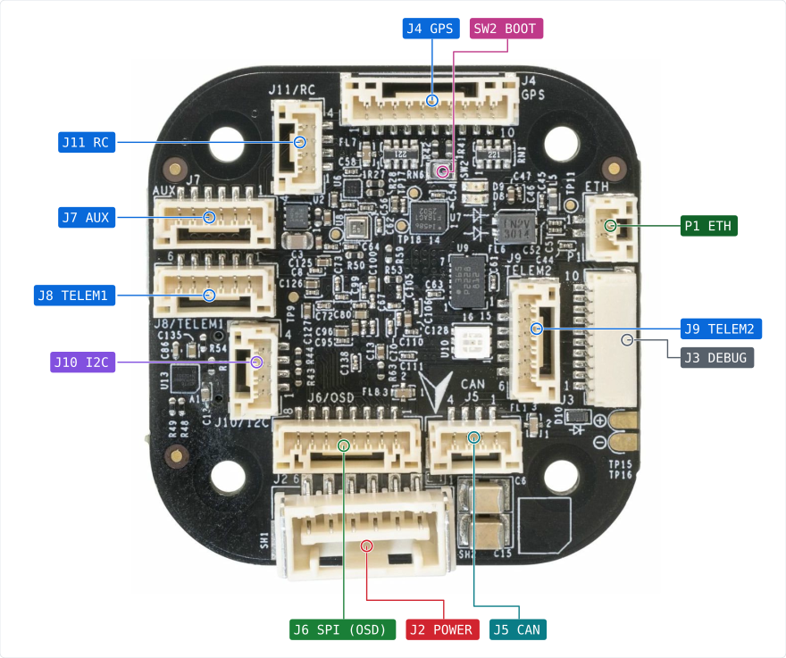
</picture>
<!-- /overview -->

<!-- overview-list:top -->
Not visible here: [J1 USB](#main-other-connectors) (bottom view) · [J12 PWM_B](#main-j12-pwm_b) (bottom view) · [J13 PWM_A](#main-j13-pwm_a) (bottom view) · [CN1 MICROSD](#main-other-connectors) (bottom view)
<!-- /overview-list -->

Bottom side, with the two ESC headers, the USB-C port and the microSD slot:

<!-- overview:bottom -->
<picture>
  <source media="(prefers-color-scheme: dark)" srcset="images/overview-bottom-dark.svg">
  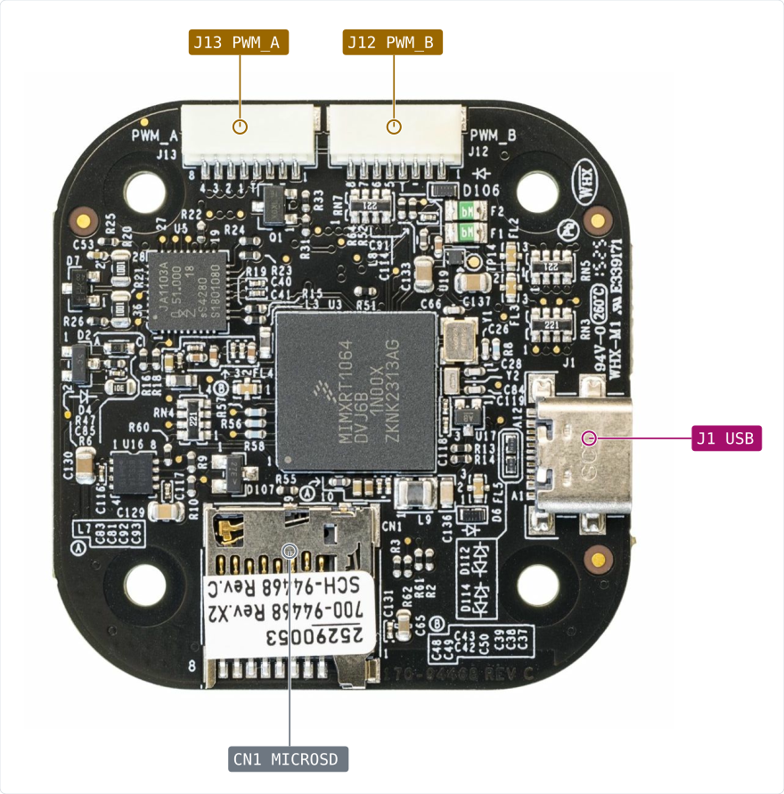
</picture>
<!-- /overview -->

## Connector index

<!-- index -->
| Ref | Function | Connector | Details |
|---|---|---|---|
| [Main CN1](#main-other-connectors) MICROSD | microSD card slot | microSD push-push, 8 pins plus card detect | Four-bit SD interface on the first SD host of the chip, used for logging. The card detect switch goes to a separate chip pin. |
| [Main J1](#main-other-connectors) USB | USB 2.0 Type-C device port | USB Type-C receptacle (USB4110-GF-A) | Serial download port of the i.MX RT1064 boot ROM, and the port used for flashing. The board is always a USB device. VBUS can also power the board through protection switch U13. |
| [Main P1](#main-p1-eth) ETH | 100BASE-T1 single pair Ethernet | JST-GH 1x2, top entry |  |
| [Main J2](#main-j2-power) POWER | Power module input, 5 V plus battery monitor I2C | Molex Clik-Mate 1x6 (5024430670) |  |
| [Main J3](#main-j3-debug) DEBUG | SWD debug and console, DS-009 debug full layout | JST-SH 1x10 |  |
| [Main J4](#main-j4-gps) GPS | GPS module with compass, safety switch and buzzer | JST-GH 1x10 (BM10B-GHS-TBT), top entry |  |
| [Main J5](#main-j5-can) CAN | CAN FD (TJA1462) | JST-GH 1x4, top entry |  |
| [Main J6](#main-j6-spi-osd) SPI (OSD) | External SPI port, meant for an on-screen display board | JST-GH 1x8 (BM08B-GHS-TBT), top entry |  |
| [Main J7](#main-j7-aux) AUX | Spare serial port with handshake lines | JST-GH 1x6 (BM06B-GHS-TBT), top entry |  |
| [Main J8](#main-j8-telem1) TELEM1 | Telemetry serial port 1 with flow control | JST-GH 1x6 (BM06B-GHS-TBT), top entry |  |
| [Main J9](#main-j9-telem2) TELEM2 | Telemetry serial port 2 with flow control | JST-GH 1x6, top entry |  |
| [Main J10](#main-j10-i2c) I2C | External I2C bus | JST-GH 1x4, top entry |  |
| [Main J11](#main-j11-rc) RC | Serial radio control receiver port | JST-GH 1x4, top entry |  |
| [Main J12](#main-j12-pwm_b) PWM_B | Motor outputs 5 to 8 (ESC header) | JST-SH 1x8 |  |
| [Main J13](#main-j13-pwm_a) PWM_A | Motor outputs 1 to 4 (ESC header) | JST-SH 1x8 |  |
<!-- /index -->

## Power and debug

<!-- heading:main/J2 -->
### Main J2 POWER
<!-- /heading -->

<!-- pinout:main/J2 -->
<picture>
  <source media="(prefers-color-scheme: dark)" srcset="images/main-J2-dark.svg">
  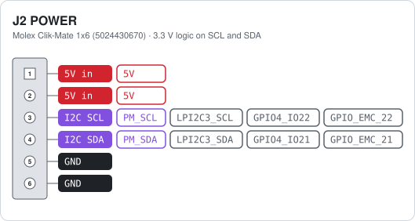
</picture>

This is the main supply of the board. The power module feeds 5 V into pins 1 and 2, and the board makes its own 3.3 V and 1.8 V from it. Pins 3 and 4 are an I2C bus that reads voltage and current from the power module.

> [!WARNING]
> Feed only 5 V into pins 1 and 2. A higher voltage damages the board, because there is no regulator behind this connector.
<!-- /pinout -->

<!-- heading:main/J3 -->
### Main J3 DEBUG
<!-- /heading -->

<!-- pinout:main/J3 -->
<picture>
  <source media="(prefers-color-scheme: dark)" srcset="images/main-J3-dark.svg">
  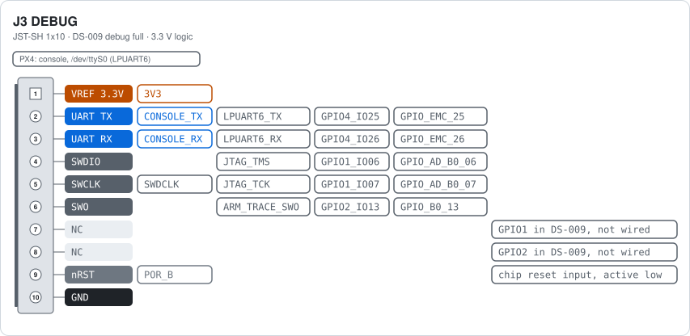
</picture>

Pin 1 is a 3.3 V reference output for the debug probe, fed. Pins 2 and 3 are the serial console. Pins 4, 5 and 6 are the SWD lines of the i.MX RT1064. Pin 9 is the reset line of the chip, which is also pulled up on the board.

> [!WARNING]
> Pin 1 is an output at 3.3 V, not a supply input. Use a debug probe that works at 3.3 V and never drive this pin.
<!-- /pinout -->

## Serial ports

<!-- heading:main/J8 -->
### Main J8 TELEM1
<!-- /heading -->

<!-- pinout:main/J8 -->
<picture>
  <source media="(prefers-color-scheme: dark)" srcset="images/main-J8-dark.svg">
  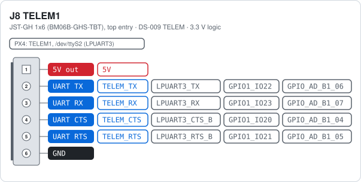
</picture>

Standard DS-009 telemetry layout: 5 V, TX, RX, CTS, RTS, ground. Pin 1 gives 5 V out through ferrite FL3.

> [!WARNING]
> Pin 1 is a 5 V output. Never feed power into it.
<!-- /pinout -->

<!-- heading:main/J9 -->
### Main J9 TELEM2
<!-- /heading -->

<!-- pinout:main/J9 -->
<picture>
  <source media="(prefers-color-scheme: dark)" srcset="images/main-J9-dark.svg">
  
</picture>

Same layout and same circuit as TELEM1, on a second serial port of the chip. Pin 1 gives 5 V out.

> [!WARNING]
> Pin 1 is a 5 V output. Never feed power into it.
<!-- /pinout -->

<!-- heading:main/J7 -->
### Main J7 AUX
<!-- /heading -->

<!-- pinout:main/J7 -->
<picture>
  <source media="(prefers-color-scheme: dark)" srcset="images/main-J7-dark.svg">
  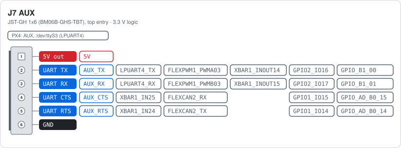
</picture>

Pin 1 gives 5 V out. Pins 2 and 3 are LPUART4, the AUX serial port (/dev/ttyS3 in PX4). Pins 4 and 5 are called CTS and RTS in the schematic but are free pins. The chips on this connector can do more than a serial port, see the pad functions on each pin: PWM on pins 2 and 3 (FlexPWM1 module 3, A and B), a quadrature encoder or a trigger through the crossbar (XBAR1) on all four signal pins, and a second CAN bus on pins 4 and 5 (FlexCAN2, needs an external transceiver).

> [!WARNING]
> Pin 1 is a 5 V output. Never feed power into it.
<!-- /pinout -->

<!-- heading:main/J11 -->
### Main J11 RC
<!-- /heading -->

<!-- pinout:main/J11 -->
<picture>
  <source media="(prefers-color-scheme: dark)" srcset="images/main-J11-dark.svg">
  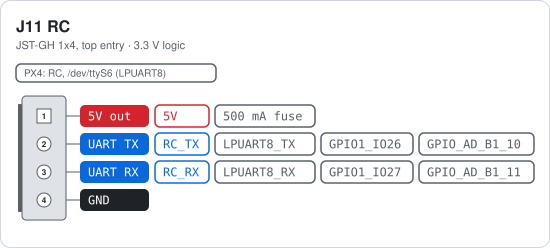
</picture>

Serial port for a digital receiver such as ELRS or CRSF. Pin 1 gives 5 V out through a resettable fuse, so a shorted receiver cannot pull down the board supply.

> [!WARNING]
> Pin 1 is a 5 V output. Never feed power into it.
<!-- /pinout -->

## GPS, I2C and CAN

<!-- heading:main/J4 -->
### Main J4 GPS
<!-- /heading -->

<!-- pinout:main/J4 -->
<picture>
  <source media="(prefers-color-scheme: dark)" srcset="images/main-J4-dark.svg">
  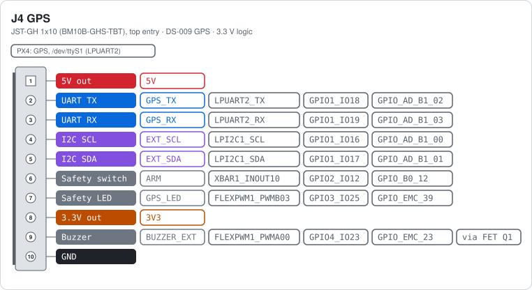
</picture>

Pin 1 gives 5 V to the GPS module and pin 8 gives 3.3 V. Both are outputs. Pins 2 to 5 are the GPS serial port and the shared I2C bus, the same bus as on the I2C connector J10. Pin 6 reads the safety switch and pin 7 drives its LED. Pin 9 is the buzzer, switched to ground by FET Q1, so the board only pulls this pin low.

> [!WARNING]
> Pins 1 and 8 are power outputs. Never feed power into them.
<!-- /pinout -->

<!-- heading:main/J10 -->
### Main J10 I2C
<!-- /heading -->

<!-- pinout:main/J10 -->
<picture>
  <source media="(prefers-color-scheme: dark)" srcset="images/main-J10-dark.svg">
  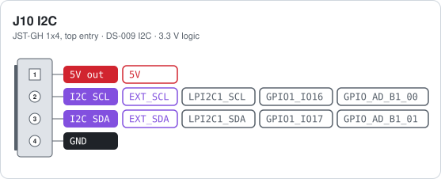
</picture>

The same bus as pins 4 and 5 of the GPS connector, so devices here share those addresses. Pin 1 gives 5 V out.

> [!WARNING]
> Pin 1 is a 5 V output. Never feed power into it.
<!-- /pinout -->

<!-- heading:main/J5 -->
### Main J5 CAN
<!-- /heading -->

<!-- pinout:main/J5 -->
<picture>
  <source media="(prefers-color-scheme: dark)" srcset="images/main-J5-dark.svg">
  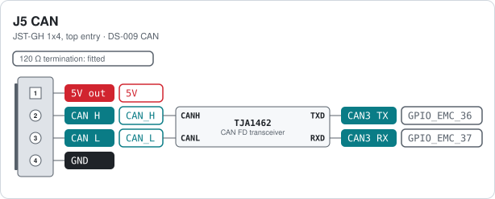
</picture>

The TJA1462 transceiver runs from 5 V and talks to the chip at 3.3 V. CANH and CANL together form the differential bus, TXD and RXD are the logic lines to the i.MX RT1064. The 120 Ω termination is fitted, so this port is one end of the bus.

> [!WARNING]
> Pin 1 is a 5 V output. Never feed power into it.
<!-- /pinout -->

## Motors

<!-- heading:main/J13 -->
### Main J13 PWM_A
<!-- /heading -->

<!-- pinout:main/J13 -->
<picture>
  <source media="(prefers-color-scheme: dark)" srcset="images/main-J13-dark.svg">
  
</picture>

Four motor signals for a four-in-one ESC. They carry normal PWM or DShot. The same pads are also FlexIO1 pins, so DShot or other protocols can be bit-banged by FlexIO. Pin 4 is the ESC telemetry line, shared with the other ESC header. The ESCs send their UART telemetry (voltage, current, RPM, temperature) on this one wire, and the chip receives it on LPUART7 in single-wire mode. It is receive only; the chip never transmits here. Pins 1 and 3 are not connected on rev F.

> [!NOTE]
> This header has no 5 V pin. Many ESCs have a BEC that powers the flight controller, but this board does not use it. It gets its 5 V from the power module on J2 POWER.
<!-- /pinout -->

<!-- heading:main/J12 -->
### Main J12 PWM_B
<!-- /heading -->

<!-- pinout:main/J12 -->
<picture>
  <source media="(prefers-color-scheme: dark)" srcset="images/main-J12-dark.svg">
  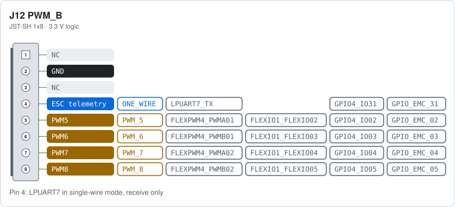
</picture>

Same circuit as PWM_A, for motors 5 to 8. The signals carry normal PWM or DShot. The same pads are also FlexIO1 pins, so DShot or other protocols can be bit-banged by FlexIO. Pin 4 is the same shared ESC telemetry line: LPUART7 in single-wire mode, receive only. Pins 1 and 3 are not connected on rev F.

> [!NOTE]
> This header has no 5 V pin. Many ESCs have a BEC that powers the flight controller, but this board does not use it. It gets its 5 V from the power module on J2 POWER.
<!-- /pinout -->

## SPI and Ethernet

<!-- heading:main/J6 -->
### Main J6 SPI (OSD)
<!-- /heading -->

<!-- pinout:main/J6 -->
<picture>
  <source media="(prefers-color-scheme: dark)" srcset="images/main-J6-dark.svg">
  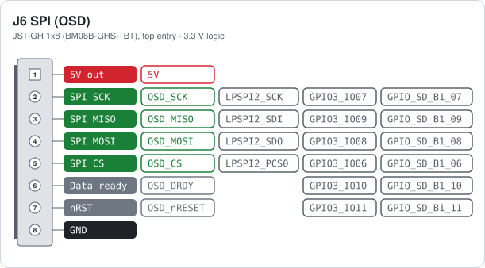
</picture>

Pin 1 gives 5 V to the add-on board, the signal lines work at 3.3 V. Pin 6 is a data-ready input and pin 7 a reset output. This port is separate from the SPI bus of the on-board sensors.

> [!WARNING]
> Pin 1 is a 5 V output. Never feed power into it.
<!-- /pinout -->

<!-- heading:main/P1 -->
### Main P1 ETH
<!-- /heading -->

<!-- pinout:main/P1 -->
<picture>
  <source media="(prefers-color-scheme: dark)" srcset="images/main-P1-dark.svg">
  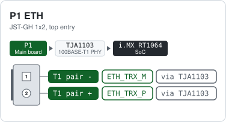
</picture>

Two wires carry send and receive at 100 Mbit/s. The TJA1103 does the physical layer and talks to the chip over RMII, so there is no direct link between these pins and a chip pad. Use a twisted pair and keep both wires the same length. The other end needs a 100BASE-T1 device or a media converter.
<!-- /pinout -->

<!-- others:main -->
### Main other connectors

| Ref | Function | Connector | Notes |
|---|---|---|---|
| J1 USB | USB 2.0 Type-C device port | USB Type-C receptacle (USB4110-GF-A) | Serial download port of the i.MX RT1064 boot ROM, and the port used for flashing. The board is always a USB device. VBUS can also power the board through protection switch U13. |
| CN1 MICROSD | microSD card slot | microSD push-push, 8 pins plus card detect | Four-bit SD interface on the first SD host of the chip, used for logging. The card detect switch goes to a separate chip pin. |
<!-- /others -->

## Buttons and switches

<!-- switches -->
| Ref | Board | Function | Type | Notes |
|---|---|---|---|---|
| SW2 BOOT | Main | Boot mode button | Push button (NANOT 240 AS) | Holding this button while the board powers up pulls boot mode 0 high and starts the serial downloader over the USB port. The second boot mode pin is tied low on the board. |
<!-- /switches -->

## Notes

- The connectors marked DS-009 on their card (TELEM1, TELEM2, GPS, I2C, CAN and the debug port)
  follow the Dronecode
  [DS-009 connector standard](https://github.com/pixhawk/Pixhawk-Standards/blob/master/DS-009%20Pixhawk%20Connector%20Standard.pdf),
  so standard cables fit.
- The board runs from 5 V on the power module connector J2, or from USB. Every other 5 V pin
  is an output.

> [!WARNING]
> Never feed power into the 5 V pin of a JST-GH connector. Power the board through J2 or USB only.

## Downloads

This reference as an [A4 PDF](MR-VMU-Tropic-hardware-reference.pdf), and all cards on one
A4 landscape sheet: [cheat sheet PDF](MR-VMU-Tropic-cheatsheet.pdf).

NXP and the NXP logo are registered trademarks of NXP B.V. This document is maintained by the
community and is not an official NXP publication.
